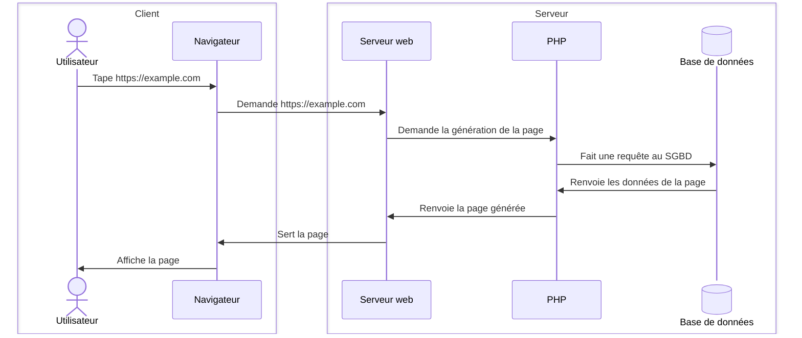

# Introduction
Qu'est-ce qu'un serveur ?
La réponse est toute con, c'est tout simplement un truc qui rend un service.
Vous allez dans un restaurant, le serveur, c'est celui à qui vous commandez votre bouffe et qui vient vous la servir. Dans le monde de l'informatique, c'est pareil, les noms sont bien choisis hein ?!🤓

Il existe une multitude de types de serveurs différents, mais on ne verra que ceux-là :
- [[Serveur physique|Le serveur physique]]
- [[Serveur web|Le serveur web]]
- [[Serveur de base de données|Le serveur de base de données]]
- [[Serveur FTP]]
# Graphiquement

