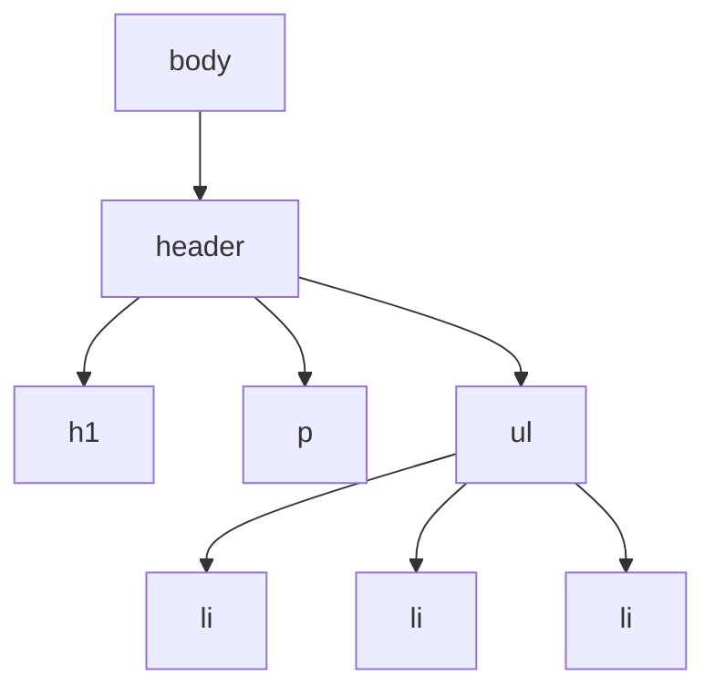

# Introduction
Et là on commence à rentrer dans le plus complexe.
Déjà un truc à savoir, JavaScript n'a **RIEN** à voir avec Java. Ça c'est dit.

Mais sinon, JavaScript, plus simplement appelé JS, est là pour venir complexifier votre page web.
Pas complexifier genre rendre plus compliqué (un peu quand-même, on va pas se le cacher), mais pour venir rajouter des choses que vous ne pourriez pas faire avec du HTML et du CSS.

Je ne vais pas rentrer dans les détails de JS, comment ça fonctionne etc... Je vais juste expliquer à quoi ça sert, et pourquoi on s'en sert.

Par exemple, pour venir interagir avec l'utilisateur, JS est roi. Pour faire des animations complexes également.
# Cas d'usage
La principale utilisation de JavaScript, c'est pour rajouter des **fonctionnalités** à votre page web. Des fonctionnalités qui interagissent avec l'utilisateur surtout.
Un bouton qui fait un bruit quand on clique dessus par exemple.
C'est tout con, mais c'est un exemple de fonctionnalité pour laquelle JS serait utilisé.

Un autre exemple serait une barre de progression de la page. Comme sur [le site de cette graphiste indépendante là](https://amaliagraphiste.fr/), j'sais pas si vous connaissez... 👀
Les carrousels également, enfin y a une infinité d'exemples à donner, la limite n'est représentée que par votre propre créativité.
# Intégration
Vous serez rarement amenés à coder vous-même, vous allez surtout faire de l'intégration du code d'autres personnes avec les frameworks notamment.
Je vais prendre l'exemple d'un carrousel [Splide](https://splidejs.com/)
## Ajout du framework à votre page
Il existe plusieurs méthodes selon si vous utilisez un gestionnaire de paquets, un gros framework ou du pur JS.
Si vous êtes en pur JS, vous devrez ajouter le script du framework à votre page, pour Splide, vous pouvez avoir des informations à ce propos sur [cette page](https://splidejs.com/guides/getting-started/).

Bref, nous on intègre directement le script à la page comme ceci :
```html
<script src="https://cdn.jsdelivr.net/npm/@splidejs/splide@4.1.4/dist/js/splide.min.js"></script>
```

Avec ça, Splide est chargé et prêt à être utilisé.

Mais il y a aussi du CSS à charger dans le cas de Splide (à rajouter dans le `<head>`) :

```html
<link rel="stylesheet" href="https://cdn.jsdelivr.net/npm/@splidejs/splide@4.1.4/dist/css/splide.min.css">
```
## Création d'un carrousel
À partir de là, ça va dépendre de ce que vous voulez faire, mais l'idée, c'est de suivre le guide officiel donné plus tôt.

```html
<section class="splide" aria-label="Splide Basic HTML Example">
	<div class="splide__track">
		<ul class="splide__list">
			<li class="splide__slide">Slide 01</li>
			<li class="splide__slide">Slide 02</li>
			<li class="splide__slide">Slide 03</li>
		</ul>
	</div>
</section>
```

Le carrousel a une structure bien définie, à vous de l'adapter à ce que vous voulez réaliser ensuite.
## Code JavaScript
Il est ensuite temps d'attacher du code au carrousel afin de le faire... Carrouseler !

```js
new Splide( '.splide' ).mount();
```

Ce bout de code dit "Créés un nouveau carrousel Splide et attache le au carrousel de class `splide`".
# Le DOM
C'est un concept très important en JS, car la principale chose que l'on fait avec du JS, c'est de **manipuler le DOM**.
Le DOM ou **D**ocument **O**bject **M**odel, c'est la représentation sous forme **d'arbre** de votre page web. C'est grâce à cela qu'il est possible d'interagir avec votre page grâce à JS.
## Un arbre ?!
ET OUI JAMY, UN ARBRE, AVEC DES RACINES ET TOUT !!!

Déjà, voici du HTML, juste le `<body>`, pour pas s'embêter :

```html
<body>
	<header>
		<h1>Ceci est un titre !</h1>
		<p>Ceci est un paragraphe</p>
		<ul>
			<li>Ceci est un élément de liste</li>
			<li>Ceci est un élément de liste</li>
			<li>Ceci est un élément de liste</li>
		</ul>
	</header>
</body>
```

Et voici sa représentation sous forme d'arbre :


Les notions importantes à comprendre pour également comprendre le DOM, ce sont les notions de parents et d'enfants.
Ici, le `<body>` est le parent de `<header>`, et `<header>` est donc son enfant.
Ensuite `<header>` a trois enfants : `<h1>`, `<p>` et `<ul>`, dont le `<header>` est le parent à tous les trois.
Et enfin, le `<ul>` a trois enfants `<li>`, dont le `<ul>` est le parent à tous les trois.
## La manipulation

> [!info]- Ce qui suit est pour un niveau plus avancé.
> C'est plus un truc de dév, mais c'est toujours utile à savoir !

Manipuler le DOM, c'est manipuler cet arbre.
Si vous voulez rajouter un `<li>` au `<ul>` par exemple, vous devriez d'abord **créer** l'élément, puis **ajouter** l'élément nouvellement créé en tant qu'enfant du `<ul>`.

```js
function ajoutLi() {
	const nouveauLi = document.createElement("li"); // Crée l'élément <li>.
	nouveauLi.textContent = "Ceci est un élément de liste"; // Rajoute le contenu à l'intérieur de la balise <li>
	
	const leUl = document.querySelector("ul"); // Récupère le <ul> dans la page.
	
	leUl.appendChild(nouveauLi); // Ajoute le <li> nouvellement créé en tant qu'enfant du <ul>.
}
```

>[!warning]- Le DOM n'est pas tout le temps manipulable
>Un point extrêmement important à connaître, c'est que le DOM est construit par le navigateur, ce qui veut dire qu'il n'est pas *toujours* complètement chargé et prêt à être manipulé.
>
>Pour être sûr et certain que le DOM soit complètement chargé, il y a trois méthodes, la principale étant tout simplement de charger votre script à la **fin** de votre `<body>`.
>La seconde étant de mettre votre code dans ce petit machin :
>```js
>document.addEventListener('DOMContentLoaded', function () {
>	/* Le code écrit ici ne sera exécuté qu'après chargement complet du DOM ! */
>	}
>);
>```
>Et la troisième, qui est pas mal recommandée, car en plus c'est mieux niveau perfs, c'est de charger votre script dans le `<head>` avec :
>```html
><head>
>	<script defer src="chemin/vers/votre/script.js"></script>
></head>
>```
>À noter qu'avec cette méthode, la seconde méthode avec `DOMContentLoaded` n'est pas nécessaire.
# Trucs et astuces
Ici, je vais vous donner 2~3 petits tips, parce que je suis super généreux et intelligent. 🤓
## La console
Que ce soit sur Firefox ou Google Chrome voir même Microsoft Edge, vous avez toujours moyen d'avoir accès aux dev tools, généralement en appuyant sur F12, normalement, ça pas de soucis.

Mais il y a un onglet très important quand on cherche à débugger du code en JavaScript, pour savoir qu'est-ce qui ne marche pas et aussi pourquoi, c'est l'onglet **Console**, dedans, vous pourrez retrouver énormément d'informations qui pourraient vous aider !
## Le mode strict

> [!info]- Ce qui suit est pour un niveau plus avancé.

Pour faire simple, il demande à JS d'être plus strict, et de ne plus laisser passer certaines pratiques. Dit comme ça, c'est vrai que ça sonne pas très très positif, mais si ça l'est ! Non seulement JS ne laisse plus passer certaines pratiques, mais en plus, il affiche plus (+) d'erreurs...

Plus sérieusement maintenant.
Plus (+) d'erreurs, ça veut dire qu'on sait ce qui va mal, c'est extrêmement important.
De plus, les pratiques empêchées par le mode strict sont généralement de mauvaises pratiques à éviter d'avoir en programmant en JavaScript.

Pour l'activer, il suffit de rajouter ceci au début de votre fichier JavaScript :

```js
"use strict";
/* et le reste de votre code après ! */
```

Et tout votre fichier sera évalué en mode strict.