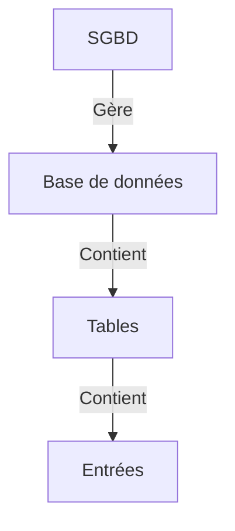

# Introduction
SQL, c'est le langage des systèmes de gestion de bases de données (SGBD).

Un petit point sécurité est disponible [[Sécurité|ici]].
# Cas d'usage
SQL sert surtout pour venir demander des trucs à la base de données.
Si votre site veut savoir qui est l'utilisateur `lulu` (voir l'exemple pratique de [[notes/les_langages_du_web/PHP#En pratique|PHP]]), il va aller demander à sa base de données "Qui est `lulu` ???".
Et la base de données sera suffisamment gentille pour lui dire tout ce qu'elle sait sur `lulu`.
# SGBD, BD et SQL
Il faut dire que ça peut porter à confusion tous ces sigles à la con.
## BD
C'est pour **B**ase de **D**onnées.
Tout simplement.

La base de données c'est, en gros, le truc qui vient stocker des données.

Qu'est-ce qu'une donnée ? Ah, question piège un peu... Car au final c'est juste des 0 et des 1. Donc en gros c'est n'importe quoi qui peut être lu par un ordinateur, du texte, des nombres... À peu près tout donc.

Donc la base de données, c'est un cerveau, mais qui **ne réfléchit PAS** (c'est la description d'un mascu oui), c'est juste de la mémoire.
## SGBD
Pour **S**ystème de **G**estion de **B**ase de **D**onnées.

Là, on commence à réfléchir un peu plus. Comme son nom l'indique, ce machin est là pour venir gérer une ou plusieurs bases de données.

Il en existe plusieurs, tous avec leurs petites spécificités. Mais celui que vous devez connaître, c'est MySQL, mais il existe aussi MariaDB ou encore PostgreSQL.
## SQL
**S**tructured **Q**uery **L**anguage ou Langage de requêtes structurées en bon françois.

Eh bien ça, c'est ce qui permet de parler avec le SGBD. Comme le nom l'indique, on écrit des **requêtes** avec.

Chaque requête est envoyée au SGBD, qui va ensuite aller chercher dans la ou les bases de données la réponse à cette requête.
# Principe de fonctionnement
Tout ce beau monde fonctionne sur plusieurs "couches" :

## Le SGBD
Le SGBD fonctionne au dessus de tout, puisque c'est lui qui vient tout gérer. C'est à lui que vous vous adressez avec SQL.
## La base de données
Gérée par le SGBD, elle représente un gros ensemble, par exemple un projet en lui-même.
## Les tables
Les tables, c'est ce qui vient contenir un ensemble de données similaire, par exemple le stock des produits d'un magasin, les utilisateurs d'un site web, etc...
Vous voyez les tableurs ? C'est la même chose concrètement, du moins dans la représentation des données.

Exemple :

| id  | nom  | date_de_naissance |          description          |
| :-: | :--: | :---------------: | :---------------------------: |
|  1  | lulu |    01/10/1999     | \<h1>J'aime les chats !\</h1> |
|  2  | jojo |    16/05/2002     |       J'aime les chiens       |
|  3  | bob  |    06/07/1969     |              Bob              |
Ceci est une table, qu'on pourrait nommer `Utilisateur` par exemple, et qui vient stocker des entrées sur les utilisateurs.

Les tables sont composées d'entrées (lignes) et de colonnes. Chaque colonne est une donnée différente.
## Les entrées
Les entrées, ce sont tout simplement les lignes d'une table. Si on reprend l'exemple du dessus, cette ligne :

|  1  | lulu | 01/10/1999 | \<h1>J'aime les chats !\</h1> |
| :-: | :--: | :--------: | :---------------------------: |
Est une entrée parmi tant d'autres.
# Exemple d'utilisation concret
Vous voulez récupérer toutes les informations de `lulu`.
Dans ce cas, une requête `SELECT` sera réalisée, par exemple :

```sql
SELECT nom, date_de_naissance, description
FROM Utilisateur
WHERE nom='lulu';
```

Ici, on demande à récupérer le nom (même si on le connaissait déjà), la date de naissance et la description de `lulu` depuis la table `Utilisateur`.